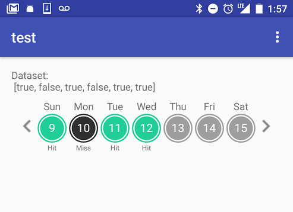

# WeekViewSwipeable
======
WeekViewSwipeable is a simple Android view for displaying data in a weekly format. Given a list of data, the last element is bound to the current calendar day, the previous is bound to yesterday, and so forth. Simply override the adapter to customize the day circles based on your inter



Useage
--------

Will be updated

Download
--------

Gradle:

```groovy
compile 'com.yuncun.weekviewswipeable:weekviewswipeable:1.0.0'

```


License
--------

    Copyright 2016 Yuncun Shen

    Licensed under the Apache License, Version 2.0 (the "License");
    you may not use this file except in compliance with the License.
    You may obtain a copy of the License at

       http://www.apache.org/licenses/LICENSE-2.0

    Unless required by applicable law or agreed to in writing, software
    distributed under the License is distributed on an "AS IS" BASIS,
    WITHOUT WARRANTIES OR CONDITIONS OF ANY KIND, either express or implied.
    See the License for the specific language governing permissions and
    limitations under the License.
