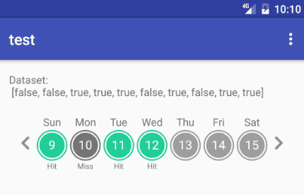

# WeekViewSwipeable

WeekViewSwipeable is a simple Android view for displaying data in a weekly format. Given a list of data, the last element is bound to the current calendar day, the previous is bound to yesterday, and so forth. Simply override the adapter to customize the day circles based on your needs.



Usage
-----

Spark is setup with reasonable default values out of the box. Just add a `SparkView` to your layout:

```xml
    <com.yuncun.swipeableweekview.WeekViewSwipeable
        android:id="@+id/calendar_component"
        android:layout_below="@id/helloworld"
        android:layout_width="match_parent"
        android:layout_height="wrap_content"
        android:layout_marginBottom="16dp"
        app:circleDefaultFillColor="@color/grey_500"
        app:circleDefaultStrokeColor="@color/grey_500"
        app:circleDefaultTextColor="@color/grey_750"
        />
```

Put your data into the `WeekViewAdapter`, and override the functions you need to customize.

```java
WeekViewSwipeable wvs = (WeekViewSwipeable) findViewById(R.id.calendar_component);
    WeekViewAdapter<Boolean> adapter = new WeekViewAdapter(record) {
        @Override
        public int getStrokeColor(final int index){
            if ((Boolean) get(index)==true){
                return ContextCompat.getColor(context, R.color.teal);
            } else {
                return ContextCompat.getColor(context, R.color.grey_600);
            }
        }

        @Override
        public int getFillColor(final int index){
            if ((Boolean) get(index)==true){
                return ContextCompat.getColor(context, R.color.teal);
            } else {
                return ContextCompat.getColor(context, R.color.grey_600);
            }
        }

        @Override
        public TextView getTextView(TextView tv, int index){
            if ((Boolean) get(index)==true){
                tv.setText("Hit");
            } else {
                tv.setText("Miss");
            }
            return tv;
        }

        @Override
        public View getDayLayout(View dv, final int index){
            dv.setOnClickListener(new View.OnClickListener() {
                @Override
                public void onClick(View view) {
                    Toast.makeText(view.getContext(), "Click! on index " + index, Toast.LENGTH_LONG).show();
                }
            });
            return dv;
        }
    };
wvs.setAdapter(adapter);
```
Download
--------

Gradle:

```groovy
compile 'com.yuncun.weekviewswipeable:weekviewswipeable:1.0.0'

```

License
--------

    Copyright 2016 Yuncun Shen

    Licensed under the Apache License, Version 2.0 (the "License");
    you may not use this file except in compliance with the License.
    You may obtain a copy of the License at

       http://www.apache.org/licenses/LICENSE-2.0

    Unless required by applicable law or agreed to in writing, software
    distributed under the License is distributed on an "AS IS" BASIS,
    WITHOUT WARRANTIES OR CONDITIONS OF ANY KIND, either express or implied.
    See the License for the specific language governing permissions and
    limitations under the License.
